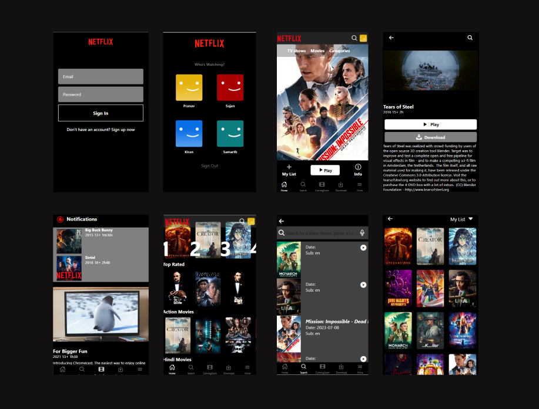

# 🚀 Netflix UI Clone in React Native using Expo

The project use the awesome [TMDB](https://www.themoviedb.org/) [API](https://www.themoviedb.org/documentation/api) to fetch the needed tv shows and movie data. 

